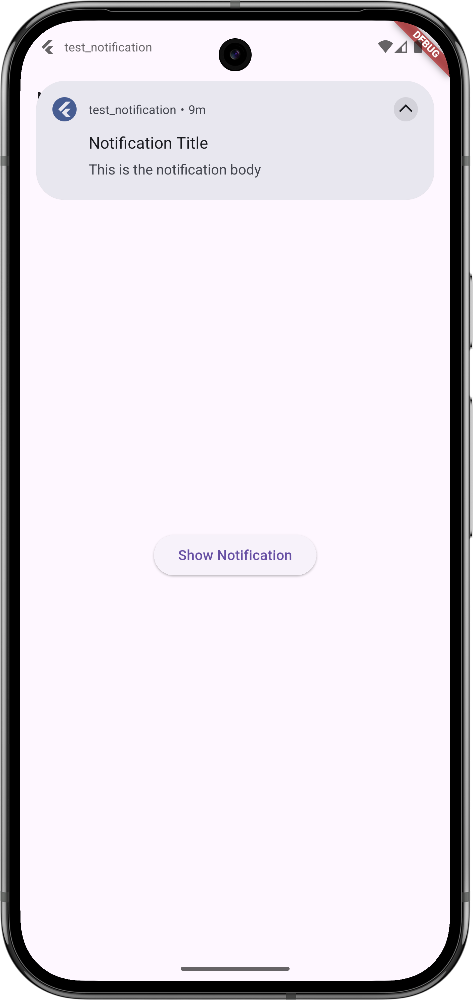

# Flutter Local Notifications

[](https://pub.dev/packages/flutter_local_notifications)

A powerful Flutter plugin for displaying local notifications on Android, iOS, and other platforms.

## Features
- Schedule notifications
- Show notifications with custom sound
- Handle notification taps
- Support for Android and iOS
- Group notifications

## Installation
Add the dependency to your `pubspec.yaml` file:

```yaml
dependencies:
  flutter_local_notifications: ^16.1.0  # Use the latest version
```

Run:
```sh
flutter pub get
```

## Usage

### Import the package
```dart
import 'package:flutter_local_notifications/flutter_local_notifications.dart';
```

### Initialize
```dart
final FlutterLocalNotificationsPlugin flutterLocalNotificationsPlugin = FlutterLocalNotificationsPlugin();

void initializeNotifications() async {
  const AndroidInitializationSettings androidSettings = AndroidInitializationSettings('@mipmap/ic_launcher');
  final InitializationSettings settings = InitializationSettings(android: androidSettings);
  await flutterLocalNotificationsPlugin.initialize(settings);
}
```

### Show a Notification
```dart
void showNotification() async {
  const AndroidNotificationDetails androidDetails = AndroidNotificationDetails(
    'channel_id', 'channel_name',
    importance: Importance.high,
    priority: Priority.high,
  );

  const NotificationDetails details = NotificationDetails(android: androidDetails);
  await flutterLocalNotificationsPlugin.show(0, 'Hello', 'This is a test notification', details);
}
```

## Screenshot



## Documentation
For full documentation, check out the [official package](https://pub.dev/packages/flutter_local_notifications).

## License
This project is licensed under the MIT License.

